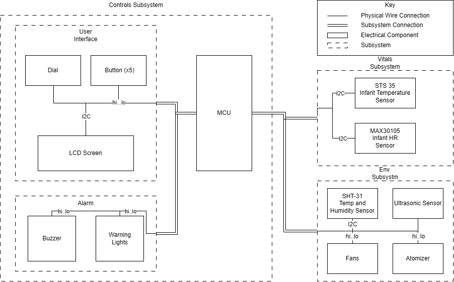

<!-- 

Innovative Global Solutions - Infant Incubator Project
FILE: index.hmtl
PURPOSE: 
AUTHOR: Fleser, Connor
CREATED: 2/16/26

 -->

<h1>Documentation for the STM code</h1>
These docs outline the basic functionality and implementation of the controls system for the IGS - Infant Incubator Project. 

<h2>Directory</h2>
<ul>
    <li><a href="./index.md">Index</a></li>
    <li><a href="./tempAndHumid.md">Temperature and Humidity</a></li>
    <li><a href="infantTemp.md">Infant Temperature</a></li>
    <li><a href="alarmSystem.md">Alarm System</a></li>
    <li><a href="userInterface.md">User Interface</a></li>
</ul>

<h2>Overview</h2>

The controls supersystem contains the UI, Alarm and MCU subystmes. Through the microcontroller it also manages the activities and actions of the external Env. subsystem and the external vitals subystem.

<figure>

<figcaption style="text-align:center">Block Digaram of Electrical Systems</figcaption> 
</figure>

Generally most subsystems are directly connected to the MCU and controlled directly either via the I2C or directly through hi and low logic signals. The above block diagram is a high level diagram that does not fully demonstrate the functional implementation of the electrical system. It should be used as a general guide to high level implementation and connections between systems. For a an electrical overview the circuit schematic should be consulted.