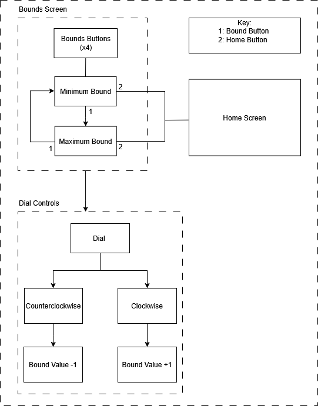

# User Interface (UI)

## Overview
The UI consists of the rotary encoder, 5 buttons, an LCD screen, and the alarm system. The five display menus are: Home, Humidity, Incubator Temperature, Infant Temperature, and Heart Rate. Excluding Home, all screens display a live sensor value, minimum bound, and maximum bound. If either the minimum or maximum bound are exceeded, the alarm system will sound. 

<figure>

<figcaption style="text-align:center">Block Digaram of UI System</figcaption> 
</figure>

As illustrated in the diagram, there are two main screens: the home and bounds screen. The home screen displays by default, but can otherwise be accessed by pressing the UI's home button. Pressing the bounds buttons for Humidity, Incubator Temperature, Infant Temperature, and Heart Rate will direct the user towards the parameter's respective bounds screen. 

The rotary dial, which operates when turned either clockwise or counterclockwise, is only applicable when a bounds button is pressed. By default, the minimum bound is selected. Pressing the same bounds button again will select the maximum bound. Turning the dial counterclockwise decreases the selected bound (Min. or Max.), while turning it clockwise increases the bound value.

